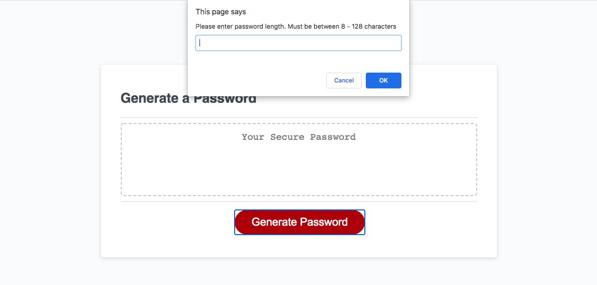
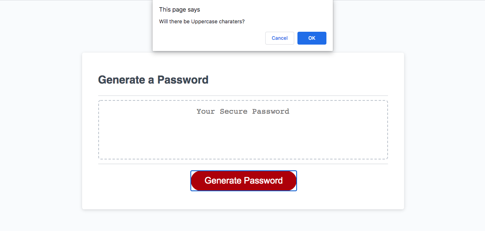
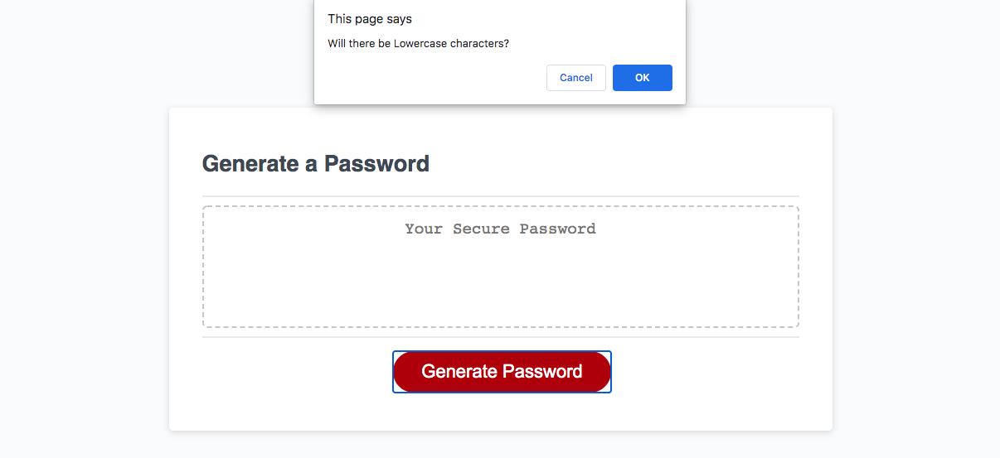
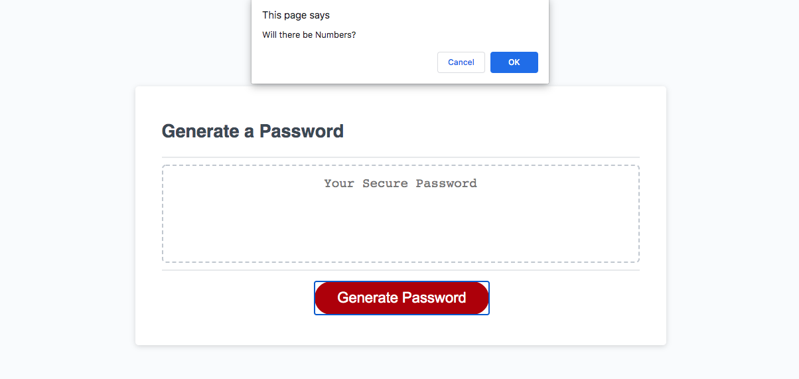
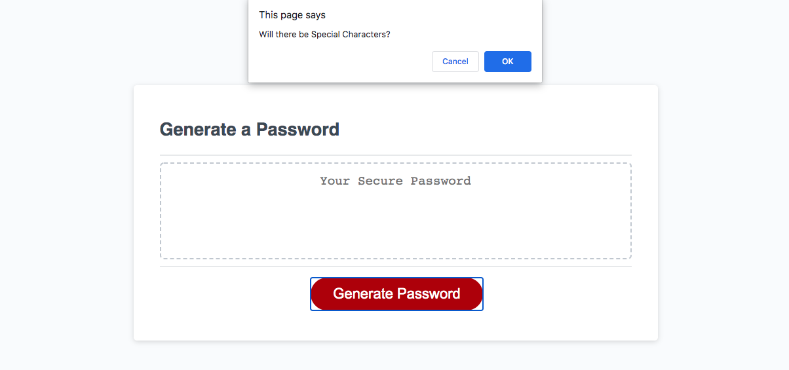
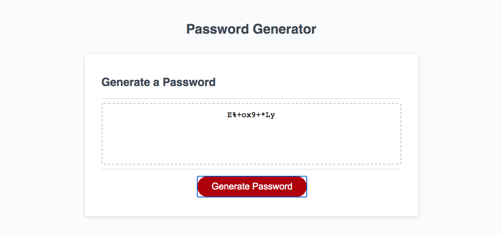

# Password Generator

## Description

The purpose of this project is to demonstrate my ability to use JavaScript to generate a unique password under certain circumstances. 

Deployed Project: https://eroux13.github.io/password_generator

## Usage

When the Generate Password button is clicked, the user is prompted to enter a password length that is between 8 - 128 characters.

Once the length is entered, the user will be prompted to select criteria to determine whether or not the generated password will have certain characters.

As long as 1 criteria is selected, a unique password will be generated at the end and its length will be according to the user's input. 

